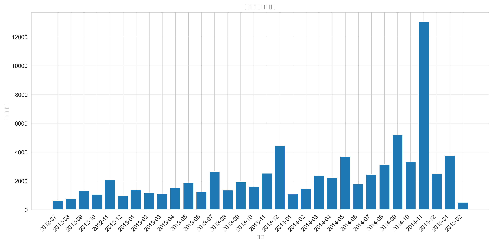
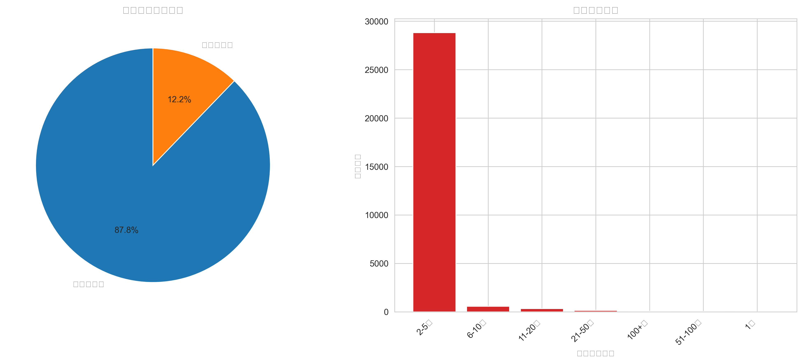

# 淘宝母婴购物数据分析项目

> ⚠️ **练习项目声明**：本项目为个人学习与练习作品，用于实践数据分析全流程。数据集来源于公开平台，分析结果仅供参考学习。

## 📌 项目简介

这是一个完整的电商数据分析实战项目，通过对淘宝2018年母婴购物数据进行分析，实践了**数据获取 → 清洗 → 分析 → 可视化**的全流程。

**项目周期**：2026年1月（个人学习项目）
**技术栈**：Python (Pandas, Matplotlib, Seaborn) + MySQL + Git

## 🎯 学习目标

1. **数据清洗实战**：处理真实数据集中的缺失值、异常值、格式转换等问题
2. **SQL与Python结合**：使用Python连接MySQL数据库进行数据处理
3. **探索性数据分析**：运用统计方法和可视化技术发现数据规律
4. **项目流程完整实践**：从需求分析到结果展示的完整数据科学流程

## 📁 项目结构
test/ (仓库根目录)
├── src/                    # 【新】存放所有源代码
│   ├── data_analyze.py
│   └── primary_clean.py
├── docs/                   # 【新】存放所有文档和报告
│   ├── analysis_report.txt
│   └── data_cleaning_report.txt        # 【新】重命名并专门存放生成结果
│── visualization_results/          # 【新】重命名并专门存放生成结果
│       ├── analysis_dashboard.png
│       ├── monthly_sales_trend.png
│       ├── top_categories.png
│       └── user_behavior.png
├── README.md               # 项目总说明（保持在根目录）

## 📊 核心发现（示例）

### 1. 销售趋势分析
- 发现明显的"双十一效应"：2014年11月销量达13,044件，是月均水平的4倍
- 识别出销售旺季和淡季，为库存管理提供参考

### 2. 商品类别分析
- 6个商品类别中，类别"50014815"占据主导地位
- 长尾效应明显，头部品类贡献大部分销售额

### 3. 用户行为洞察
- 用户价值分层：基于购买频次和金额划分高/中/低价值用户

## 🚀 快速开始

### 环境配置
bash
克隆项目
git clone https://github.com/InevitableTimelan/test.git
cd test

安装依赖
pip install pandas matplotlib seaborn mysql-connector-python
### 运行步骤
1. 数据准备：将数据集导入MySQL数据库
2. 数据清洗：运行 `python data_cleaning.py`
3. 数据分析：运行 `python data_analyze.py`
4. 查看结果：在 `visualization_results/` 目录查看生成图表

## 🛠️ 技术要点

### 数据清洗部分
- **缺失值处理**：使用中位数填充数值型字段，众数填充类别型字段
- **异常值检测**：识别并处理购买数量为负值等异常记录
- **格式标准化**：日期字段转换、文本字段统一格式

### 数据分析部分
- **趋势分析**：月度销售趋势、季节性分析
- **相关性分析**：商品属性与销量的关系
- **用户分群**：基于RFM模型的价值分层

## 📈 可视化展示

| 图表类型 | 说明 | 洞察 |
|---------|------|------|
|  | 月度销售趋势图 | 识别促销活动影响 |
|  | 商品类别分析 | 发现头部品类 |
|  | 用户行为分析 | 用户价值分层 |

## 📚 学习收获

通过本项目，我掌握了：
- ✅ 使用Pandas进行复杂数据清洗
- ✅ MySQL与Python的数据交互
- ✅ 数据可视化图表的选择与优化
- ✅ Git版本控制与GitHub项目管理
- ✅ 完整的数据分析报告撰写

## 🔗 相关资源

- **数据集来源**：[阿里云天池 - 淘宝用户行为数据集](https://tianchi.aliyun.com/dataset/)
- **参考教程**：[DataCamp - Data Analysis with Python](https://www.datacamp.com/)
- **工具文档**：[Pandas官方文档](https://pandas.pydata.org/)

## 👨‍💻 关于作者

**安徽大学 23级互联网金融专业学生**
- 🔭 **当前学习**：数据分析、机器学习、AI基础
- 🌱 **未来方向**：考研AI专业，聚焦数据分析与算法
- 📫 **联系方式**：[GitHub主页](https://github.com/InevitableTimelan)
- 📝 **学习笔记**：持续记录数据分析学习历程

---

> 💡 **学习心得**：本项目让我深刻理解了理论到实践的差距，真实数据的"脏乱"特性促使我学习多种清洗技巧，业务问题的分析让我学会了从数据中寻找故事。

## 📄 许可证

本项目仅用于学习交流，遵循 [MIT License](LICENSE)。

---

**如果这个项目对你有帮助，欢迎给个⭐️ Star！你的支持是我持续学习的动力！**
